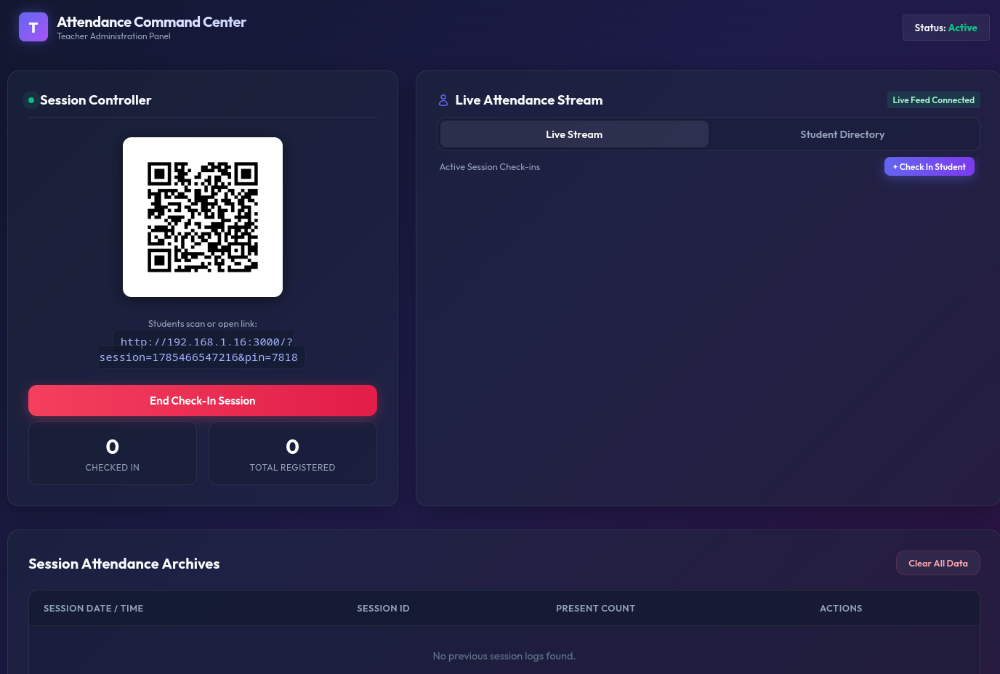
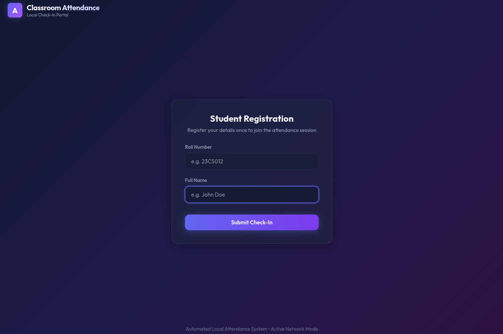

# Automated Attendance System

An automated, web-based classroom attendance system that uses dynamic rotating QR codes and local router network identification to make tracking attendance fast, secure, and hassle-free.

## Features

- **Dynamic Rotating QR Codes:** The check-in QR code rotates its 4-digit PIN every 30 seconds to prevent students from sharing static screenshots of the check-in URL.
- **Rolling PIN Grace Period:** Supports check-ins using the current or immediately previous PIN (30-second grace window) to guarantee seamless check-ins during transitions.
- **Teacher Panel Authentication:** Secured administration dashboard and API endpoints with session cookies. On startup, the system logs a randomly generated password to the console (or reads from the `ADMIN_PASSWORD` environment variable).
- **Auto-Registration:** First-time students register their roll numbers and names automatically. Browser caches the identity in `localStorage` for one-tap subsequent scans.
- **Server-Sent Events (SSE):** Real-time, live stream dashboard updates for teachers as students check in.
- **Proxy/Cheat Detection:** Checks client IP addresses and browser fingerprints (`User-Agent`) to flag students attempting to submit attendance for classmates.
- **No Internet Required:** Operates entirely over a local Wi-Fi router network.

## Screenshots

<p align="center">
  
  
</p>

## Tech Stack

- **Backend:** Node.js, Express
- **Frontend:** HTML5, CSS3 (Vanilla), Vanilla JS
- **Real-time Communication:** Server-Sent Events (SSE)
- **Database:** Local JSON files (`data/attendance.json`, `data/students.json`)

## Getting Started

### Prerequisites

- Node.js installed on your machine.
- A local network (Wi-Fi router) that both the host (teacher) and clients (students) are connected to.

### Installation

1. Clone the repository:
   ```bash
   git clone https://github.com/ichhabalsingh/automated-attendance
   cd automated-attendance
   ```

2. Install dependencies:
   ```bash
   npm install
   ```

3. Start the server:
   ```bash
   # Start with a randomly generated admin password:
   npm start

   # Or run with a custom admin password:
   ADMIN_PASSWORD=mysecurepassword npm start
   ```

4. Open the teacher dashboard in your browser:
   Use the URL logged in your console (e.g., `http://<teacher-local-ip>:3000/teacher`). Log in using the password generated in the console logs.

---

## Security Considerations & Limitations

While this system contains robust offline checks, deploying it in real-world educational or corporate networks introduces specific security considerations:

### 1. Wi-Fi Client Isolation (Network Block)
Most institutional/campus Wi-Fi networks enable **Client Isolation** (or AP Isolation) by default. This security feature blocks devices connected to the same AP from communicating with each other. If enabled, student phones will not be able to connect to the teacher's local IP address.
* *Mitigation:* The teacher should host their own local network (e.g., using a portable travel router or laptop mobile hotspot).

### 2. NAT & Shared Gateway False Positives
The server flags double-registrations from the same IP address. However, if the campus network routes multiple clients through a shared gateway or proxy (NAT), multiple legitimate students may appear to have the same IP address. This causes "Proxy Alert" false positives on the teacher panel.

### 3. VPN / Campus Range Bypasses
If students have access to the campus Wi-Fi network from outside the physical classroom (e.g., from their dorm rooms or adjacent hallways), they can still scan a shared link and mark their attendance. 

### 4. HTTP Protocol Snooping
Because the system runs on local HTTP, traffic is unencrypted. PINs and session tokens could be intercepted via packet sniffing on insecure local networks. 
* *Mitigation:* In high-security settings, configure local HTTPS (e.g., using local SSL certificates).

---

## License

MIT License
